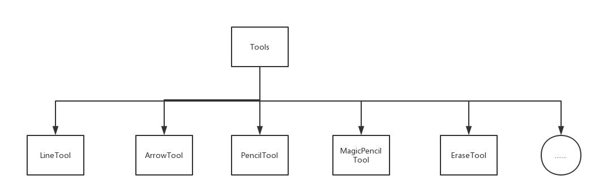
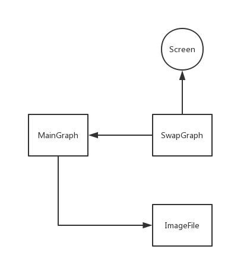
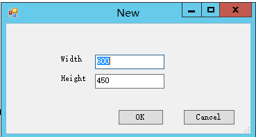
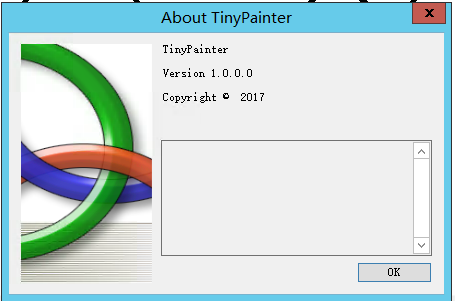
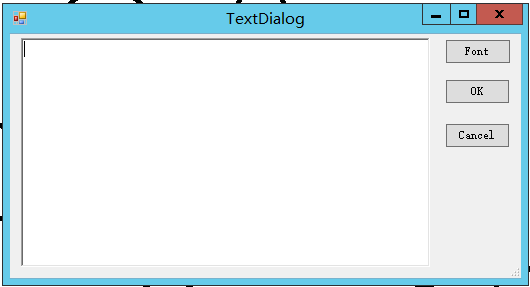
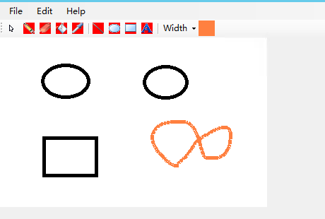
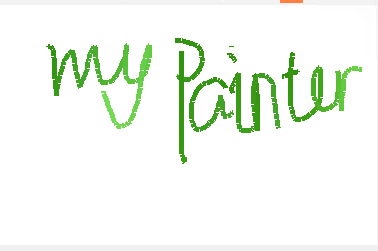

## TinyPainter

### Introduction

This application provides various kinds of functions to enable users to show or summerize their opinions in group meetings
or in other cases. It supports its users to create, modify, or redo their works. Also we provide some special functions in this program, such as magic color features and code-highlighting funtions. 

Moreover, although it is just a homework in school, I wish to follow some rules in software engineering and make this program a usable one. Thus any help, advice or pull request in Github is welcome. Hope to hear from you.

In this documentation, in the first part I will introduce some basic parts of this program and for some interesting part I will briefly introduce how I implemented it. In the second part, there will be some screenshots and basic turtorials of this software. In the final part, some references will be listed and I want to talk about my future plan of this program.

### System Analysis

When we attend a group meeting or some talk shows. It is quite ordinary that we have to show others our idea and obtain support from others. Graphs are good forms to do so. We can paint our plan and write some words on the graph to shortly state our opinions. Moreover, as a coder, in some cases we have to show others our algorithms through psedocode. Therefore a friendly environment for writing psedocode is quite necessary for our coders.

The main aim for this software is to provide a good environment for coders to show their opinions in a group meeting. Also we can use this application to paint a graph to show our idea in our plan or record some notes from teachers in the class. It enables us to draw some basic objects on a graph map and save or copy it to anywhere we like. In the end, I want to privide a good environment for coders to show their ideas with psedocode.

This system is implemented with C# and .NET framework. Therefore it will mainly work on windows platform. However, as .NET framework is now available on Linux/MACOS platfrom, I may transform this program to these platform some time in the future. Currently I have no idea about this plan. It will mainly depend on my mood in the future. Obviosly, this system can work on almost every PC and other computers running Windows.

To implement this program, there are a lot techniques required. To develop the basic form, some basic knowledge of Windows Form is needed. The basic tools to paint basic objects on the map will need GDI+. Moreover, to implement code highlight, some knowledge in theory of compile, especially DFA is necessary. Finally, some color gradient knowledge is needed to develop the magic color function.

Some basic information about this system is here below:  

- Platfrom: Windows
- Develop Environment: Windows Server
- Lisence: MIT
- User Interface: Windows Form
- Tools inplementation: GDI+
- Version Control: Git

### Implemtntation

To implemant this Windows desktop application, I use the classical MVC framework to design this program. Here is some of the objects I involved in this application design process.

#### Controller

- Tools
	- Tools is the basic object of all painting tools, it provides some quite useful functions and event handlers for its child objects to inherit. By using polymorphism, we greatly decrease the complexity of programming and standard our painting tools.
	- The __Tools__ object provides the following functions.
		- getRectangle(Point st, Point en): Get current area of painting
		- UnloadTool(): Unload current tool and dispose the swap bitmap to save the space we use.
		- flushswap(): Used to flush the swap bitmap and paint it to the screen when users are painting
		- updatemaingraph(): update the maingraph when a motion is over.
		- MouseDown(object,MouseEventArgs): Handle the event when the mouse is moving down. This function is not implemented and it should be inherited by the children of __Tools__.
		- MouseUp(object,MouseEventArgs): Handle the event when the mouse is moving up. This function is not implemented and it should be inherited by the children of __Tools__.
		- MouseMove(object,MouseEventArgs): Handle the event when the mouse is moving. This function is not implemented and it should be inherited by the children of __Tools__.

- The Tools object has a great number of child objects, they will do some actual works to paint geometric objects on our screen. Here are some of the objects I have implemented.



By using polymorphic, the complexity of programming is dramatically reduced and we can easily implement our program.  


#### View

In this program, I design 3 UIs to link our users and program.

- MainPainter: The most important UI, I use this user interface to access the functions and data of tools.
- NewTab: I design this UI to solve the question of new a new graph.
- WriteDialog: Provide some functions to let the users to write freely.

The overall data flow graph is shown below.

</img>

### Some Problems

When I designed this program, I met a lot of problems and here are some of them.

#### How To Implement Fill Tool

I use a very classic problem in Computer Graphics -- Seed Fill Algorithm. I used a stack to record the current node and expand them every time. It works quite fine. The algorithm is here below:  

```
Procedure SeedFill(Point st)  
{
	Stack <Point> S;
	S.push(st);
	while(!S.empty()){
		Point cur = S.top();
		S.pop();
		PaintCurPointWithGivenColor;
		for every dir:
			Point next = cur.neighbourIndir;
			if next.color == st.color
				S.push(next)
	}
	return;
}
```


#### Save Strategy

To save our graph and use as less space as possible, we use the following strategy to store our user's work.

When the user is doing its work, the swap graph is flushing back and forth in order to display live picture to the screen. When a motion from the user is over, then we should store the swap graph to the main graph.

When it comes to save the file, we just copy the bitmap from screen to the image file. Therefore our saving stategy is shown below.



#### Magic Pencil

One of the most important features of this program is that our user can use a magic color with general changing color. This problem is called Image Gradient in DIP. And I solve this question using the following algorithm.

```
Procedure MagicPencil():
	Color st = RandomColor;
	while(Pencil.Moving()):
		st.R+=sd;
		st.G+=sd;
		st.B+=sd;
		if(sd < 0 && st.R < 0 || st.G <=0 || st.B <=0){
			sd = 1;
			st.R = st.R<0?1:st.R
			st.G = st.G<0?1:st.G
			st.B = st.B<0?1:st.B
		}
		if(sd > 0 && st.R > 255 || st.G > 255 || st.B > 255){
			sd = -1;
			st.R = st.R>255?255:st.R
			st.G = st.G>255?255:st.G
			st.B = st.B>255?255:st.B
		}
```

### Application Show

- new a tab

</img>

- The about picture.

</img>

- Text Dialog

</img>

- Paint some of the basic geometric objects.

</img>

- Magic Pencil Feature

</img>

### More About This Project

- This project is open-sourced and we can get the source code from this <a href="https://github.com/Aaron19960821/TinyPainter">link</a>.
- An tiny installer is also provided and you can just find it in this <a href="https://github.com/Aaron19960821/TinyPainter/tree/master/TinyPainter/publish">link</a>
- Some new features are planing, I want my painter to have more features such as the text dialog support more language rendering.
- This is the first project I make after I started learning coding in C# and .NET and some of the notes can be find in my <a href="https://aaron19960821.github.io">blog</a>.
- Any advice or pull requests for this project are welcomed.

### Reference

[1] Mahesh Chand. Graphics Programming with GDI+. Publishing House of Electronics Industry, 2005.  
[2] Stephen Prata. C# Primer Plus. 人民邮电出版社, 2005